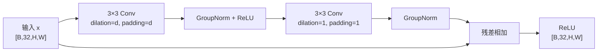

# Snake AI

基于 Double DQN 与 Dueling DQN 的贪吃蛇强化学习项目。代码包含可渲染的游戏环境、Vector/Grid/Hybrid 三种状态输入、动态棋盘 CNN、经验回放、阶段验证、checkpoint 选拔、独立评估，以及 TensorBoard/W&B 日志。

## 🚀 快速启动游戏

```bash
uv run --extra cpu snake-play
```

> 这是游戏的唯一推荐启动命令。首次运行会自动安装项目依赖和 CPU 版 PyTorch，
> 下载时间可能稍长；之后再次启动会直接复用已有环境。Windows 用户也可以双击
> 根目录的 `start_game.bat`。

## 当前默认配置

直接运行 `python -m snake_ai.train` 时使用以下主要默认值：

| 项目 | 默认值 |
|---|---:|
| 棋盘 | `20 × 20` |
| 状态模式 | `hybrid` |
| 奖励配置 | `experiment8` |
| 势函数进度奖励 | 开启，可用 `--no-potential-reward` 关闭 |
| 步成本与饥饿成本 | 开启，可用 `--no-cost-rewards` 关闭 |
| 最大训练局数 | `15000` |
| 单局训练步数上限 | `experiment8` 不设独立上限；`reference` 默认 `500` |
| Batch size | `128` |
| Discount factor `gamma` | `0.99` |
| Learning rate | `0.001` |
| Epsilon | 从 `1.0` 线性降至 `0.01`，默认衰减 `7500` 局 |
| 隐藏层宽度 | `256` |
| CNN 主干/投影通道 | `32 / 8` |
| 残差块 dilation | `1, 1, 2` |
| Target network 同步间隔 | `1000` 次学习更新 |
| 周期验证单局步数上限 | `1000` |

默认值以 [config.py](src/snake_ai/config.py) 和命令行解析函数为准；可执行下面的命令查看完整参数：

```bash
uv run --extra cpu python -m snake_ai.train --help
uv run --extra cpu python -m snake_ai.evaluate --help
```

## 项目结构

```text
src/snake_ai/
├── agents/
│   ├── dqn_agent.py       # Double DQN、epsilon-greedy、checkpoint
│   └── replay_buffer.py   # 固定容量经验回放
├── game/
│   ├── snake_env.py       # 环境、状态编码、奖励与终止规则
│   └── renderer.py        # pygame 渲染
├── models/
│   └── q_network.py       # 当前 architecture v3
├── config.py              # 环境、训练与奖励 profile
├── validation.py          # 固定种子评估与阶段验证调度
├── train.py               # 训练入口
├── evaluate.py            # 独立评估入口
└── utils.py               # 随机种子与统计工具

scripts/
├── train_autodl.sh / .ps1
└── evaluate.sh / .ps1
```

10×10 的 Hamiltonian + tail-safe A* 推理规划器位于独立并列分支，不改动当前
6×6 游戏 AI。原理、数学条件、代码流程、运行方法和性能说明见
[10×10 推理规划器说明](docs/planning_10x10_hamiltonian_astar_guide.md)。

## 安装与测试

项目要求 Python 3.12+。游戏环境与 GPU 训练环境使用互斥的 PyTorch 依赖，避免训练时误用 CPU 版。只运行游戏、加载 checkpoint 和进行 AI 推理时选择 `cpu`：

```bash
uv sync --extra cpu
uv run --extra cpu pytest
```

> **PyTorch 版本说明：**只运行游戏时使用 `cpu` 即可；当前 AutoDL 训练使用 CUDA 12.4 对应的 `cu124`，两者不能同时选择。训练脚本会执行 CUDA 检查；检查失败时直接停止，不会退回 CPU 训练。

```bash
uv sync --extra cu124
uv run --extra cu124 python -c "import torch; print(torch.__version__, torch.cuda.is_available())"
```

## 游戏

等价的模块启动方式：

```bash
uv run --extra cpu python -m snake_ai.game.game_app
```

首版固定使用 `6 × 6` 棋盘，提供三种模式：

- `PLAY SOLO`：玩家单人游戏；
- `WATCH AI`：观察当前内置 AI 自动游戏；
- `HUMAN VS AI`：玩家和 AI 在双棋盘中进行公平竞速；
- `RULES`：在游戏内查看完整规则与操作。

玩家使用方向键或 `WASD` 转向，`P` 或 `Esc` 暂停。玩家模式开局前有 3 秒倒计时，倒计时期间也可以提前输入方向；直接反向的按键会按贪吃蛇规则忽略。规则页可以从主菜单或暂停菜单进入；设置页使用上下方向键或界面的 `+/-` 按钮，在 1～20 tick/s 间以 1 tick/s 为步长调整逻辑速度（默认 6 tick/s），也可以开关声音。渲染固定为 60 FPS，局内只显示 Score 和 Steps，所有可视化单局最多运行 400 step。

本局结束后，棋盘会先停留并显示 `GAME OVER` 2 秒，再打开结算窗口。结算窗口显示胜者、双方分数与 step，并简要说明满分、碰撞、400 step 比分或平局等输赢原因。

竞速模式使用相同初始状态和逻辑时钟。双方第 `n` 个食物由相同的比赛 seed 与进食序号生成同源候选排列，首个合法格作为各自食物；先达到棋盘满分者获胜。`6 × 6` 棋盘共 36 格、初始蛇长 3，因此满分为 33。碰撞者失败，400 step 后仍未满分则按分数和取得最终分数的先后顺序裁决。

当前唯一 AI 固定加载 `checkpoints/dqn_20260715_091735/best.pt`。加载过程严格校验棋盘、状态模式、奖励配置、网络类型和 checkpoint 架构；文件缺失或配置不匹配时会明确报错，不会切换到其他权重。

AI checkpoint 会在主菜单首帧显示后于后台预加载；首次点击 AI 模式时若尚未完成，会显示加载界面，避免阻塞主菜单响应。

## 训练

直接训练当前默认 Hybrid 模型：

```bash
uv run --extra cu124 python -m snake_ai.train
```

训练默认不连接 W&B。首次使用先执行 `uv run wandb login`，再显式加入 `--wandb`：

```bash
uv run --extra cu124 python -m snake_ai.train --wandb
```

启用后，run 会实时写入项目 `Snake`，并为该 run 创建一个固定的 `2 列 × 3 行` saved view。若 W&B 登录、网络或工作区布局配置失败，训练会明确报错并停止，不会退回自动生成的散乱面板。

三种状态模式：

```bash
# 20 维人工特征 MLP
uv run --extra cu124 python -m snake_ai.train --state-mode vector

# 纯 9 通道棋盘 CNN
uv run --extra cu124 python -m snake_ai.train --state-mode grid

# 9 通道棋盘 CNN + 20 维人工特征（默认）
uv run --extra cu124 python -m snake_ai.train --state-mode hybrid
```

Linux/AutoDL 与 PowerShell 包装脚本会把额外参数转发给训练入口：

```bash
bash scripts/train_autodl.sh --width 10 --height 10
```

```powershell
.\scripts\train_autodl.ps1 --width 10 --height 10
```

10×10 轻量 Hamiltonian 生存性掩码训练必须显式加入 `--mask`：

```bash
bash scripts/train_autodl.sh --mask --width 10 --height 10
```

`--mask` 默认关闭，并且只接受 10×10、Hybrid、`experiment8` 配置；不带该参数时不会创建
规划器，原 6×6 的动作选择、经验回放、TD 目标、验证默认值和 checkpoint 结构保持不变。
训练与周期验证不会运行 A*；独立正式推理仍使用 Hamiltonian + tail-safe A* 完整规划器。
完整原理与 checkpoint 区分见
[10×10 安全规划器说明](docs/planning_10x10_hamiltonian_astar_guide.md)。

### QNetwork 详细架构

`QNetwork` 根据 `state_mode` 选择 Vector 路径或 Grid/Hybrid 路径。默认动作数为 3，分别表示直行、右转和左转。


每个 `ResidualBlock(d)` 的内部结构如下：



GroupNorm 的组数不是硬编码值。`_group_count(channels, preferred)` 会从期望组数向下寻找能整除通道数的最大值，因此自定义 `8、12、16、32` 等通道数仍能得到合法配置。GroupNorm 不依赖 batch 统计量，训练 replay batch 和单状态动作选择使用相同归一化规则。

默认 `H=W=20` 时，各路径维度为：

| 路径 | 进入隐藏层前 | 隐藏特征 | Dueling 输出 |
|---|---:|---:|---:|
| Vector | `20` | `256` | `V: 1`，`A: 3` |
| Grid | `8×20×20 + 200 = 3400` | `256` | `256→128→1/3` |
| Hybrid | `3400 + 20 = 3420` | `256` | `256→128→1/3` |

棋盘高宽直接来自 `--height` 和 `--width`，CNN 不做空间下采样或自适应池化。因此进入隐藏层的全局特征维度和融合全连接层参数量随棋盘面积变化，checkpoint 评估时必须使用与训练一致的棋盘尺寸。

局部分支始终截取蛇头周围 `5 × 5`。它先从 Grid 的 `2:6` 方向通道定位蛇头，再给 `local_projection` 特征图四周补两格零，将其展平后直接 `gather` 目标窗口的 25 个位置。固定相对索引通过 `persistent=False` buffer 缓存，会随模型移动到 CPU/CUDA，但不写入 `state_dict`。该实现不再为全部 `H×W` 位置生成 `unfold` 候选窗口，输出和梯度与原实现严格等价，已有 architecture v3 checkpoint 可继续加载。

当 `dueling=False` 时，不再使用 Value/Advantage 分支，而是通过单个 `Linear(256→3)` 直接输出动作 Q 值。当前训练入口默认启用 Dueling。

### 状态输入

| 模式 | 输入 | 特点 |
|---|---|---|
| `vector` | `[20]` | 低参数量人工特征基线。 |
| `grid` | `[9,H,W]` | 只使用空间状态，不包含独立 hunger 旁路。 |
| `hybrid` | `([9,H,W], [20])` | CNN 空间特征与完整人工状态融合。 |

20 维 Vector 状态由以下部分组成：

| 维度范围 | 内容 |
|---|---|
| 1–3 | 直行、右转、左转是否危险 |
| 4–7 | 当前绝对移动方向 |
| 8–11 | 食物位于蛇头的左、右、上、下方向 |
| 12–13 | 食物相对蛇头的归一化 `dx/dy` |
| 14–16 | 三个相对动作方向到墙的归一化距离 |
| 17–19 | 三个相对动作方向到最近蛇身的归一化距离 |
| 20 | `hunger_ratio` |

9 通道 Grid 状态：

| 通道 | 内容 |
|---:|---|
| 0 | 棋盘边界提示 |
| 1 | 蛇身（不含蛇头，包含蛇尾） |
| 2–5 | 分别朝左、右、上、下的蛇头通道 |
| 6 | 蛇尾 |
| 7 | 食物 |
| 8 | 从蛇头 `1.0` 到蛇尾 `1/snake_length` 的身体顺序 |

### DQN 学习流程

- `policy_net` 使用 epsilon-greedy 选择动作；评估时 `training=False`，不随机探索。
- ReplayBuffer 满足一个 batch 后，每个环境 step 采样一批 Transition。
- Double DQN 使用 `policy_net` 选择下一动作，再用 `target_net` 评估该动作。
- 损失函数为 Huber loss（`SmoothL1Loss`），梯度范数裁剪到 `10.0`。
- 每隔 `target_update_interval` 次学习更新，把 `policy_net` 参数复制到 `target_net`。
- Epsilon 默认线性衰减；传入 `--epsilon-exp-decay` 后改为每局乘以 `--epsilon-exp-factor`。

### 奖励配置

| 配置 | `reference` | `experiment8` |
|---|---:|---:|
| `food_reward` | `10` | `10` |
| `collision_penalty` | `-100` | `-100` |
| `starvation_penalty` | `-100` | `-12` |
| `win_reward` | `90` | `20` |
| `step_penalty` | `-0.01` | `-0.005` |
| `hunger_penalty_scale` | `0` | `0.02` |
| 步成本范围 | 不含吃食移动 | 所有合法移动 |
| 饿死时成本 | `replace` | `accumulate` |
| 未进食上限 | 棋盘面积 + 蛇长，`>=` 触发 | 棋盘面积，`>` 触发 |

`experiment8` 在合法且未吃到食物的移动后计算二次饥饿成本：

```text
hunger_ratio  = min(steps_since_food / starvation_limit, 1)
hunger_reward = -0.02 × hunger_ratio²
```

例如 `6×6` 棋盘的 `starvation_limit=36`；连续第 36 步未进食时饥饿成本为 `-0.02`，第 37 步仍封顶为 `-0.02` 并触发饿死，再叠加步成本和 `-12` 饿死惩罚。吃到食物会把 `steps_since_food` 清零。

`RewardConfig` 中 `reference.potential_reward=False`，`experiment8.potential_reward=True`；但训练 CLI 当前默认显式开启势函数奖励，因此切换到 `reference` 后若要采用它原本的势函数开关，还需传入：

```bash
uv run --extra cu124 python -m snake_ai.train --reward-profile reference --no-potential-reward
```

其他常用覆盖：

```bash
# 关闭逐步成本和饥饿成本
uv run --extra cu124 python -m snake_ai.train --no-cost-rewards

# 显式限制每个训练 episode 的步数
uv run --extra cu124 python -m snake_ai.train --max-steps-per-episode 1000
```

未指定 `--max-steps-per-episode` 时，`experiment8` 不设置独立训练步数上限，`reference` 使用 `500`。这只是默认值，不是强制约束，命令行可以覆盖。

### 阶段验证与 checkpoint

每个训练 run 会生成：

```text
checkpoints/<run_name>/latest.pt
checkpoints/<run_name>/best.pt          # epsilon 到达下限并完成首次阶段验证后才出现
checkpoints/<run_name>/config.json
runs/<run_name>/config.json
runs/<run_name>/train_metrics.csv
runs/<run_name>/validation_metrics.csv
runs/<run_name>/events...train
```

- `latest.pt` 保存最近的训练状态。
- Epsilon 首次到达下限时，运行 100 局 quick 与 500 局 confirmation 验证，并建立首个 best。
- 之后默认每 500 个训练 episode 运行 quick；通过筛选后才进入 confirmation。
- quick 和 confirmation 默认每局最多执行 `1000` 步，可用 `--validation-max-steps` 修改；提前碰撞、饿死或占满棋盘仍会立即结束。
- quick/confirmation 的均分差先除以各自棋盘满分，再换算为6×6满分33的等价分差；
  因此同一套选拔阈值可以用于不同网格。6×6直接使用原始均分差，行为与历史实现一致。
- 验证使用独立环境、固定且互不重叠的逐局种子，不写 replay buffer，也不改变训练网络状态。
- 训练默认不开启早停。传入 `--early-stop` 后，达到 `--min-episodes` 才累计 patience；达到目标确认均分或连续多轮无确认提升时才停止。
- `config.json` 和 checkpoint 的 `run_config` 保存环境、奖励、训练、网络和验证配置。

## 评估

默认加载最新训练目录的 `latest.pt`，评估 1000 局、每局最多执行 1000 步，并打开 pygame：

```bash
uv run --extra cpu python -m snake_ai.evaluate
```

常用的无渲染评估：

```bash
uv run --extra cpu python -m snake_ai.evaluate \
  --checkpoint checkpoints/<run_name>/best.pt \
  --episodes 1000 \
  --max-steps 1000 \
  --no-render
```

达到 `--max-steps` 但环境尚未终止的局会记录为 `timed_out=True`。该上限只限制评估，不改变训练 episode 的步数规则。

只有传入 `--tensorboard` 时，评估才会写入 `eval_metrics.csv` 和 `.eval` TensorBoard event；输出目录默认映射到 checkpoint 对应的 `runs/<run_name>`，也可用 `--eval-output-dir` 覆盖。每次评估开始时会覆盖 `eval_metrics.csv`，避免中断重跑或评估不同 checkpoint 时混入旧数据。

```bash
uv run --extra cpu python -m snake_ai.evaluate --no-render --tensorboard
```

评估会从 checkpoint 自动读取 `state_mode`，但棋盘 `--width/--height` 仍由命令行决定，必须与 checkpoint 的 `state_size` 一致。

当前代码只加载 `architecture_version=3` 的 checkpoint，并要求架构元数据完整；不会猜测缺失字段或回退到历史网络。旧 checkpoint 仍可作为实验档案保留，需要评估时应使用与其匹配的历史 Git 版本。

## 日志、TensorBoard 与 W&B

训练 CSV/TensorBoard 主要记录：

- 得分、近 100 局平均分、吃食效率和 episode 步数；
- episode 总奖励及 food/progress/step/hunger/terminal 奖励分量；
- epsilon、Huber loss、近 100 局平均 loss 和 replay buffer 大小；
- quick/confirmation 验证均分、满盘率、超时率及 best 晋升结果。

评估记录逐局得分、步数、吃食效率、最大蛇长和超时状态，并输出总体均值、标准差、满盘率与超时率。

```bash
uv run tensorboard --logdir runs
```

浏览器打开 `http://localhost:6006`。同一 run 中 `.train` 和 `.eval` event 可以同时存在，分别使用 `train/*`、`validation/*` 与 `eval/*` tag。

`--wandb` 的六个面板按参考图固定为：

| 行 | 左 | 右 |
|---|---|---|
| 1 | Score：`score`、`score_rolling50`、`mean_score_100` | Reward：`episode_reward`、`mean_reward_100` |
| 2 | Episode Steps：`steps`、`steps_rolling50` | Loss：`loss`、`mean_loss_100` |
| 3 | Epsilon：`epsilon` | Replay Buffer Size：`replay_buffer_size` |

横轴统一为 `episode`，每个 episode 只调用一次 W&B 日志写入，避免 W&B 内部 step 与训练局数错位。W&B 原生 Line Plot 不支持 Matplotlib 中原始曲线的半透明度，也不能分别指定参考图所用的左上/右上图例角落；W&B 工作区也没有随 episode 动态更新的整图标题和底部注释。代码已固定面板布局、顺序、标题、坐标轴、曲线集合、颜色和线宽，saved view 名称包含 run name，最新值进入 run summary，但上述三处视觉细节无法完全一致。

## 环境返回值

`SnakeEnv.step()` 返回：

```python
observation, reward, done, info
```

`info` 包含：

- `score`、`steps`、`snake_length`、`steps_since_food`；
- `reward_food`、`reward_progress`、`reward_step`、`reward_hunger`、`reward_terminal`、`reward_total`；
- `termination_reason`：`none`、`collision_wall`、`collision_body`、`starvation` 或 `board_completed`。

## 可复现性

训练与评估都会设置 Python、NumPy、PyTorch 和 CUDA 随机种子。训练默认优先速度；`--deterministic` 会同时设置：

| 配置 | 默认 | `--deterministic` |
|---|---:|---:|
| `torch.use_deterministic_algorithms` | `False` | `True` |
| `torch.backends.cudnn.deterministic` | `False` | `True` |
| `torch.backends.cudnn.benchmark` | `True` | `False` |

阶段验证和独立评估为每个 episode 使用固定且独立的种子，因此同一模型可以在相同局面集合上公平比较。

不同 GPU、CUDA、驱动或 PyTorch 版本之间仍可能存在细微差异。

## 远程训练

SSH 断开可能终止前台进程，建议使用 tmux：

```bash
tmux new -s snake
bash scripts/train_autodl.sh
# Ctrl+B，然后按 D，断开并保留后台会话
tmux attach -t snake
```
