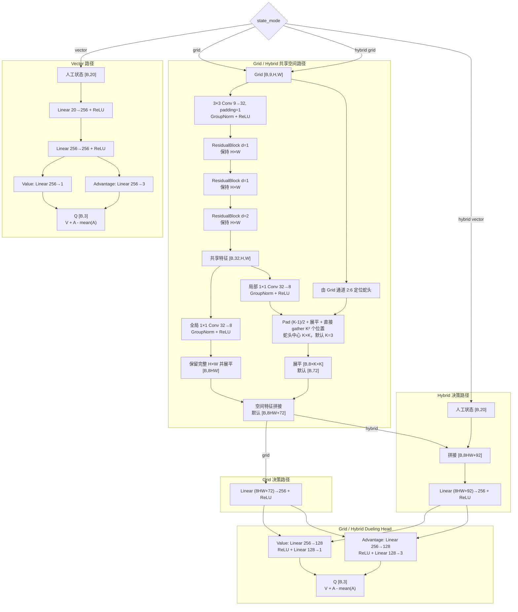
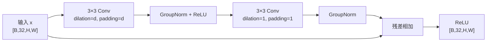

# Snake AI

支持 Double/Dueling DQN 与 PPO 的贪吃蛇强化学习项目。代码包含可渲染的游戏环境、Vector/Grid/Hybrid 三种状态输入、动态棋盘 CNN、经验回放或 on-policy rollout、阶段验证、checkpoint 选拔、独立评估，以及 TensorBoard/W&B 日志。

## 🚀 快速启动游戏

```bash
uv run --extra cpu snake-play
```

> 这是游戏的唯一推荐启动命令。首次运行会自动安装项目依赖和 CPU 版 PyTorch，
> 下载时间可能稍长；之后再次启动会直接复用已有环境。Windows 用户也可以双击
> 根目录的 `start_game.bat`。

## 当前默认配置

训练入口在使用 GPU 训练环境（`uv run --extra cu124 python -m snake_ai.train`）时，使用以下主要默认值：

| 项目 | 默认值 |
|---|---:|
| 棋盘 | `6 × 6` |
| 状态模式 | `hybrid` |
| 奖励配置 | `experiment8` |
| 势函数进度奖励 | 严格 PBRS，开启；可用 `--no-potential-reward` 关闭 |
| 步成本与饥饿成本 | 开启，可用 `--no-cost-rewards` 关闭 |
| 算法 | `dqn`（Double / Dueling DQN） |
| 最大训练局数 | `40000` |
| 单局训练步数上限 | `experiment8` 不设独立上限；`reference` 默认 `500` |
| Batch size | `128` |
| Discount factor `gamma` | `0.99` |
| TD target 步数 `n-step` | `1` |
| Learning rate | `0.0001` |
| 经验回放 | proportional PER（可用 `--no-PER` 切换为均匀回放） |
| Replay warm-up | `2000` 个环境 step |
| Epsilon | 从 `1.0` 线性降至 `0.01`，默认按环境 step 衰减，`300000` step 到达下限 |
| 隐藏层宽度 | `256` |
| CNN 主干/投影通道 | `32 / 8` |
| 残差块 dilation | `1, 1, 2` |
| Target network 同步间隔 | `1000` 次学习更新 |
| 早停 | 开启；最少训练 `15000` 局后生效，可用 `--no-early-stop` 关闭 |
| 周期验证 | 每 `1000` 局；quick/confirmation 为 `100 / 500` 局，单局上限 `2000` 步 |

默认值以 [config.py](src/snake_ai/config.py) 和命令行解析函数为准；可执行下面的命令查看完整参数：

```bash
uv run --extra cpu python -m snake_ai.train --help
uv run --extra cpu python -m snake_ai.evaluate --help
```

## 项目结构

```text
src/snake_ai/
├── agents/
│   ├── dqn_agent.py       # Double DQN、epsilon-greedy、checkpoint
│   ├── ppo_agent.py       # PPO、GAE、Actor-Critic、checkpoint
│   └── replay_buffer.py   # 固定容量经验回放
├── game/
│   ├── modes/             # Solo、AI Viewer 与 Race 模式
│   ├── ai_profiles.py     # 游戏内 AI 注册表
│   ├── controllers.py     # 玩家与 DQN 控制器
│   ├── food_policy.py     # 随机与竞速食物策略
│   ├── game_app.py        # Pygame 应用入口
│   ├── session.py         # 单局状态与步进
│   └── snake_env.py       # 环境、状态编码、奖励与终止规则
├── models/
│   └── q_network.py       # 当前 architecture v3
├── ui/                    # 音频、主题、组件和棋盘渲染
├── config.py              # 环境、训练与奖励 profile
├── validation.py          # 固定种子评估与阶段验证调度
├── wandb_logging.py       # W&B 指标与工作区布局
├── train.py               # 训练入口
├── evaluate.py            # 独立评估入口
└── utils.py               # 随机种子与统计工具

scripts/
├── train_autodl.sh / .ps1
└── evaluate.sh / .ps1
```

## 安装与测试

项目要求 Python 3.12+。CPU 与 CUDA 12.4 版 PyTorch 通过互斥的可选依赖安装：

- 只运行游戏、加载 checkpoint、观看 AI 或进行评估推理时，使用 `--extra cpu`；
- 使用 NVIDIA GPU 训练时，使用 `--extra cu124`；
- 已经通过某一种 extra 创建好虚拟环境后，后续命令仍建议显式保留对应的 `--extra`，以保证依赖选择与用途一致。

只运行游戏、加载 checkpoint 和进行 AI 推理时：

```bash
uv sync --extra cpu
uv run --extra cpu pytest
```

> **设备选择说明：**训练入口本身优先使用 CUDA，并在 CUDA 不可用时退回 CPU。Windows
> `train_autodl.ps1` 会选择 `cu124` 并检查 CUDA；Linux `train_autodl.sh` 只检查当前
> 环境，不会自动选择 extra。需要严格使用 GPU 时，推荐使用下面的显式 `--extra cu124`
> 命令并先检查 `torch.cuda.is_available()`。

```bash
uv sync --extra cu124
uv run --extra cu124 python -c "import torch; print(torch.__version__, torch.cuda.is_available())"
```

## 游戏

等价的模块启动方式：

```bash
uv run --extra cpu python -m snake_ai.game.game_app
```

首版固定使用 `6 × 6` 棋盘，提供三种模式：

- `PLAY SOLO`：玩家单人游戏；
- `WATCH AI`：观察当前内置 AI 自动游戏，并显示其 AI ID；
- `HUMAN VS AI`：玩家和 AI 在双棋盘中进行公平竞速，并显示 AI ID；
- `RULES`：在游戏内查看完整规则与操作。

玩家使用方向键或 `WASD` 转向，`P` 或 `Esc` 暂停。玩家模式开局前有 3 秒倒计时，倒计时期间也可以提前输入方向；直接反向的按键会按贪吃蛇规则忽略。规则页可以从主菜单或暂停菜单进入；设置页使用上下方向键或界面的 `+/-` 按钮，在 1～20 tick/s 间以 1 tick/s 为步长调整逻辑速度（默认 6 tick/s），也可以开关声音。渲染固定为 60 FPS，局内只显示 Score 和 Steps，所有可视化单局最多运行 400 step。

本局结束后，棋盘会先停留并显示 `GAME OVER` 2 秒，再打开结算窗口。结算窗口显示胜者、双方分数与 step，并简要说明满分、碰撞、400 step 比分或平局等输赢原因。

竞速模式使用相同初始状态和逻辑时钟。双方第 `n` 个食物由相同的比赛 seed 与进食序号生成同源候选排列，首个合法格作为各自食物；先达到棋盘满分者获胜。`6 × 6` 棋盘共 36 格、初始蛇长 3，因此满分为 33。碰撞者失败，400 step 后仍未满分则按分数和取得最终分数的先后顺序裁决。

当前唯一 AI（ID：`dqn_20260722_201922`）固定加载 `checkpoints/dqn_20260722_201922/best.pt`。加载过程严格校验棋盘、状态模式、奖励配置和 checkpoint 架构；文件缺失或配置不匹配时会明确报错，不会切换到其他权重。

仓库不包含 `checkpoints/` 下的模型文件。`PLAY SOLO` 不依赖 checkpoint；使用
`WATCH AI` 或 `HUMAN VS AI` 前，需要自行把对应模型放到上述路径。

AI checkpoint 会在主菜单首帧显示后于后台预加载；首次点击 AI 模式时若尚未完成，会显示加载界面，避免阻塞主菜单响应。

## 训练

直接训练当前默认 Hybrid 模型：

```bash
uv run --extra cu124 python -m snake_ai.train
```

切换为 PPO 并使用 PPO 专用奖励时，状态、网络宽度、验证和早停配置继续使用同一组公共参数；run 名称自动改为 `ppo_YYYYMMDD_HHMMSS`：

```bash
uv run --extra cu124 python -m snake_ai.train --algorithm ppo --reward-profile experiment_ppo
```

PPO 默认使用 `2048` 步 rollout、`128` minibatch、`4` 个 update epochs、`GAE λ=0.95`、`clip=0.2` 和 `target KL=0.02`。entropy coefficient 从首局的 `0.05` 线性退火到 `0.001`：未开启早停时默认在 `max-episodes` 结束退火，开启早停时默认在 `min-episodes` 结束退火；可用 `--ppo-entropy-anneal-episodes` 显式覆盖。`experiment_ppo` 的进食奖励为 `4.0`，碰撞惩罚保持 `-4.0`。公共 `--learning-rate` 默认仍为 `1e-4`。

按最新一次 10×10 实验配置直接运行 PPO（仅替换算法和算法专属参数，学习率采用当前公共默认值）：

```bash
uv run --extra cu124 python -m snake_ai.train \
  --algorithm ppo \
  --width 10 --height 10 \
  --state-mode hybrid \
  --reward-profile experiment_ppo --potential-reward \
  --max-episodes 40000 \
  --batch-size 128 --gamma 0.99 --learning-rate 0.0001 \
  --hidden-size 256 \
  --cnn-channels 32 --cnn-output-channels 8 \
  --cnn-dilations 1 1 2 \
  --local-crop --local-crop-size 3 \
  --ppo-rollout-steps 2048 --ppo-update-epochs 4 \
  --ppo-gae-lambda 0.95 --ppo-clip-coefficient 0.2 \
  --ppo-value-clip-coefficient 0.2 \
  --ppo-entropy-coefficient 0.05 \
  --ppo-entropy-coefficient-end 0.001 \
  --ppo-value-loss-coefficient 0.5 \
  --ppo-max-grad-norm 0.5 --ppo-target-kl 0.02 \
  --early-stop --min-episodes 15000 \
  --validation-interval 1000 \
  --validation-episodes 100 --confirmation-episodes 500 \
  --validation-patience 8 --validation-max-steps 2000 \
  --seed 42 --wandb
```

默认 `--n-step 1` 使用传统 one-step TD target。要聚合未来 3 步真实奖励：

```bash
uv run --extra cu124 python -m snake_ai.train --n-step 3
```

DQN 默认按环境交互步数对 epsilon 做线性衰减：

```text
epsilon_start        = 1.0
epsilon_end          = 0.01
epsilon_decay_unit   = step
epsilon_linear_steps = 300000
```

可以覆盖衰减步数，或切回历史实验使用的 15000-episode 线性衰减：

```bash
uv run --extra cu124 python -m snake_ai.train --epsilon-linear-steps 250000

uv run --extra cu124 python -m snake_ai.train \
  --epsilon-decay-unit episode \
  --epsilon-linear-episodes 15000
```

`--epsilon-exp-decay` 继续保留；启用后固定按 episode 乘以
`--epsilon-exp-factor`，不使用线性衰减单位。

DQN 默认使用 proportional PER；新经验以当前最大优先级写入，采样使用 Sum Tree，Huber loss 使用 importance-sampling 权重，并根据 Double DQN TD error 更新优先级。默认参数为 `alpha=0.6`、`beta=0.4` 线性退火至 `1.0`（100,000 次学习更新）、`epsilon=1e-6`。如需均匀经验回放，可传入：

```bash
uv run --extra cu124 python -m snake_ai.train --no-PER
```

`--PER` 是 DQN 专属参数，与 `--algorithm ppo` 同时使用会直接报错。

训练默认不连接 W&B。首次使用先执行 `uv run wandb login`，再显式加入 `--wandb`：

```bash
uv run --extra cu124 python -m snake_ai.train --wandb
```

启用后，run 会实时写入项目 `Snake`，并创建两个两列布局的 section：四个公共面板使用 `2 × 2`，算法专属面板按数量自动计算行数。若 W&B 登录、网络或工作区布局配置失败，训练会明确报错并停止，不会退回自动生成的面板。

三种状态模式：

```bash
# 20 维人工特征 MLP
uv run --extra cu124 python -m snake_ai.train --state-mode vector

# 纯 9 通道棋盘 CNN
uv run --extra cu124 python -m snake_ai.train --state-mode grid

# 9 通道棋盘 CNN + 20 维人工特征（默认）
uv run --extra cu124 python -m snake_ai.train --state-mode hybrid
```

Linux/AutoDL 与 PowerShell 包装脚本会把额外参数转发给训练入口：

```bash
bash scripts/train_autodl.sh --width 10 --height 10
```

```powershell
.\scripts\train_autodl.ps1 --width 10 --height 10
```

### QNetwork 详细架构

`QNetwork` 根据 `state_mode` 选择 Vector 路径或 Grid/Hybrid 路径。默认动作数为 3，分别表示直行、右转和左转。



每个 `ResidualBlock(d)` 的内部结构如下：



GroupNorm 的组数不是硬编码值。`_group_count(channels, preferred)` 会从期望组数向下寻找能整除通道数的最大值，因此自定义 `8、12、16、32` 等通道数仍能得到合法配置。GroupNorm 不依赖 batch 统计量，训练 replay batch 和单状态动作选择使用相同归一化规则。

默认 `H=W=6` 时，各路径维度为：

| 路径 | 进入隐藏层前 | 隐藏特征 | Dueling 输出 |
|---|---:|---:|---:|
| Vector | `20` | `256` | `V: 1`，`A: 3` |
| Grid | `8×6×6 + 72 = 360` | `256` | `256→128→1/3` |
| Hybrid | `360 + 20 = 380` | `256` | `256→128→1/3` |

棋盘高宽直接来自 `--height` 和 `--width`，CNN 不做空间下采样或自适应池化。因此进入隐藏层的全局特征维度和融合全连接层参数量随棋盘面积变化，checkpoint 评估时必须使用与训练一致的棋盘尺寸。

局部分支默认开启，通过 `--local-crop-size K` 截取蛇头周围的 `K × K` 区域，`K` 默认为 `3`，且必须是正奇数。它先从 Grid 的 `2:6` 方向通道定位蛇头，再给 `local_projection` 特征图补零，将其展平后直接 `gather` 目标窗口的 `K²` 个位置。固定相对索引通过 `persistent=False` buffer 缓存，会随模型移动到 CPU/CUDA，但不写入 `state_dict`。使用 `--no-local-crop` 可完全移除局部投影和裁剪分支，此时 Grid/Hybrid 进入隐藏层前的维度分别为 `8HW` 和 `8HW+20`；使用 `--local-crop` 可显式启用。缺少这两个配置字段的历史 DQN architecture v3 与 PPO architecture v1 checkpoint 会自动按原有的“启用 `5 × 5` 局部分支”加载。

当 `dueling=False` 时，不再使用 Value/Advantage 分支，而是通过单个 `Linear(256→3)` 直接输出动作 Q 值。当前训练入口默认启用 Dueling。

### 状态输入

| 模式 | 输入 | 特点 |
|---|---|---|
| `vector` | `[20]` | 低参数量人工特征基线。 |
| `grid` | `[9,H,W]` | 只使用空间状态，不包含独立 hunger 旁路。 |
| `hybrid` | `([9,H,W], [20])` | CNN 空间特征与完整人工状态融合。 |

20 维 Vector 状态由以下部分组成：

| 维度范围 | 内容 |
|---|---|
| 1–3 | 直行、右转、左转是否危险 |
| 4–7 | 当前绝对移动方向 |
| 8–11 | 食物位于蛇头的左、右、上、下方向 |
| 12–13 | 食物相对蛇头的归一化 `dx/dy` |
| 14–16 | 三个相对动作方向到墙的归一化距离 |
| 17–19 | 三个相对动作方向到最近蛇身的归一化距离 |
| 20 | `hunger_ratio` |

9 通道 Grid 状态：

| 通道 | 内容 |
|---:|---|
| 0 | 棋盘边界提示 |
| 1 | 蛇身（不含蛇头，包含蛇尾） |
| 2–5 | 分别朝左、右、上、下的蛇头通道 |
| 6 | 蛇尾 |
| 7 | 食物 |
| 8 | 从蛇头 `1.0` 到蛇尾 `1/snake_length` 的身体顺序 |

### DQN 学习流程

- `policy_net` 使用 epsilon-greedy 选择动作；评估时 `training=False`，不随机探索。
- 经验从第一步开始写入 ReplayBuffer；累计达到 `--learning-starts`（默认 `2000`）且样本满足一个
  batch 后，每个环境 step 采样一批 Transition 并更新网络。传入 `--learning-starts 0` 可关闭
  warm-up。
- `--n-step N` 会先聚合最多 `N` 步真实折扣奖励，再以实际跨度 `k` 使用
  `gamma**k` bootstrap；自然终止的尾部不 bootstrap，默认 `N=1`。
- Double DQN 使用 `policy_net` 选择下一动作，再用 `target_net` 评估该动作。
- 损失函数为 Huber loss（`SmoothL1Loss`），梯度范数裁剪到 `10.0`。
- 每隔 `target_update_interval` 次学习更新，把 `policy_net` 参数复制到 `target_net`。
- Epsilon 默认在 300000 个环境 step 内线性衰减；可通过 `--epsilon-decay-unit episode` 切回按局线性衰减。传入 `--epsilon-exp-decay` 后改为每局乘以 `--epsilon-exp-factor`。

### PPO 学习流程

- Actor-Critic 复用 Dueling DQN 完全相同的 Vector/Grid/Hybrid 特征编码和等形双分支；Actor 输出三个离散动作的 logits，Critic 输出状态价值。
- 训练动作从 `Categorical` 策略采样，验证和评估固定使用最大 logits 动作。
- rollout 满 `--ppo-rollout-steps` 后，使用 GAE、clipped policy objective、clipped value loss 和 entropy bonus 更新。
- 默认同时对当前 rollout 的 advantage 和 return 做 z-score；可分别通过 `--no-ppo-normalize-advantage` 和 `--no-ppo-normalize-returns` 关闭。
- 真实终止不 bootstrap；训练步数截断会 bootstrap Critic，但 GAE 不跨 reset 传播。
- 环境返回的 reward 不做 clipping 或 normalization；上述 return normalization 只发生在 PPO 更新阶段。

### 奖励配置

| 配置 | `reference` | `experiment8` |
|---|---:|---:|
| `food_reward` | `10` | `10` |
| `collision_penalty` | `-100` | `-100` |
| `starvation_penalty` | `-100` | `-12` |
| `win_reward` | `90` | `20` |
| `step_penalty` | `-0.01` | `-0.005` |
| `hunger_penalty_scale` | `0` | `0.02` |
| 步成本范围 | 不含吃食移动 | 所有合法移动 |
| 饿死时成本 | `replace` | `accumulate` |
| 未进食上限 | 棋盘面积 + 蛇长，`>=` 触发 | 棋盘面积，`>` 触发 |

`experiment8` 在合法且未吃到食物的移动后计算二次饥饿成本：

```text
hunger_ratio  = min(steps_since_food / starvation_limit, 1)
hunger_reward = -0.02 × hunger_ratio²
```

例如 `6×6` 棋盘的 `starvation_limit=36`；连续第 36 步未进食时饥饿成本为 `-0.02`，第 37 步仍封顶为 `-0.02` 并触发饿死，再叠加步成本和 `-12` 饿死惩罚。吃到食物会把 `steps_since_food` 清零。

势函数进度奖励严格使用 `beta × (gamma × Φ(s') - Φ(s))`。`Φ` 是蛇头到当前食物的归一化
曼哈顿距离势函数；吃到食物后，`s'` 使用新生成的食物，碰撞、饿死和占满棋盘等终止状态统一令
`Φ(s') = 0`。因此终止动作也会产生用于抵消累计 shaping 的 potential correction。

`RewardConfig` 中 `reference.potential_reward=False`，`experiment8.potential_reward=True`；但训练 CLI 当前默认显式开启势函数奖励，因此切换到 `reference` 后若要采用它原本的势函数开关，还需传入：

```bash
uv run --extra cu124 python -m snake_ai.train --reward-profile reference --no-potential-reward
```

其他常用覆盖：

```bash
# 关闭逐步成本和饥饿成本
uv run --extra cu124 python -m snake_ai.train --no-cost-rewards

# 显式限制每个训练 episode 的步数
uv run --extra cu124 python -m snake_ai.train --max-steps-per-episode 1000
```

未指定 `--max-steps-per-episode` 时，`experiment8` 不设置独立训练步数上限，`reference` 使用 `500`。这只是默认值，不是强制约束，命令行可以覆盖。

### 阶段验证与 checkpoint

每个训练 run 会生成：

```text
checkpoints/<run_name>/latest.pt
checkpoints/<run_name>/best.pt          # 达到算法对应的选拔起点并完成首次阶段验证后出现
checkpoints/<run_name>/config.json
runs/<run_name>/config.json
runs/<run_name>/train_metrics.csv
runs/<run_name>/validation_metrics.csv
runs/<run_name>/events...train
```

- `latest.pt` 保存最近一次模型快照和部分 Agent 状态，但不包含 optimizer、replay/rollout buffer 或随机数状态，当前不支持完整断点续训。
- DQN 在 epsilon 首次到达下限时、PPO 在达到 `--min-episodes` 时，运行 100 局 quick 与 500 局 confirmation 验证，并建立首个 best。
- 之后默认每 1000 个训练 episode 运行 quick；通过筛选后才进入 confirmation。
- quick 和 confirmation 默认每局最多执行 `2000` 步，可用 `--validation-max-steps` 修改。验证环境关闭饥饿机制，因此只会因碰撞、占满棋盘或达到验证步数上限结束。
- quick/confirmation 的均分差先除以各自棋盘满分，再换算为6×6满分33的等价分差；
  因此同一套选拔阈值可以用于不同网格。6×6直接使用原始均分差，行为与历史实现一致。
- 验证使用独立环境、固定且互不重叠的逐局种子，不写 replay buffer，也不改变训练网络状态。
- 训练默认开启早停；达到 `--min-episodes`（默认 15000）后才累计 patience。达到目标确认均分或连续多轮无确认提升时停止；传入 `--no-early-stop` 可改为跑满最大训练局数。
- `config.json` 和 checkpoint 的 `run_config` 保存环境、奖励、训练、网络和验证配置。

## 评估

默认在 `dqn_*` 和 `ppo_*` 中加载时间戳最新实验的 `latest.pt`，再根据 checkpoint 的 `algorithm` 自动创建对应 agent。评估默认运行 2000 局、每局最多执行 1000 步，并打开 pygame：

```bash
uv run --extra cpu python -m snake_ai.evaluate
```

常用的无渲染评估：

```bash
uv run --extra cpu python -m snake_ai.evaluate \
  --checkpoint checkpoints/<run_name>/best.pt \
  --episodes 1000 \
  --max-steps 1000 \
  --no-render
```

达到 `--max-steps` 但环境尚未终止的局会记录为 `timed_out=True`。该上限只限制评估，不改变训练 episode 的步数规则。

PPO 的循环回退默认关闭，此时评估保持纯 `argmax`。显式传入下列参数后，同一完整状态再次出现时会依次尝试第二、第三高概率动作；训练入口传入同名参数时，只影响阶段验证，不影响训练采样：

```bash
uv run --extra cpu python -m snake_ai.evaluate --algorithm ppo --argmax-cycle-fallback
```

只有传入 `--tensorboard` 时，评估才会写入 `eval_metrics.csv` 和 `.eval` TensorBoard event；输出目录默认映射到 checkpoint 对应的 `runs/<run_name>`，也可用 `--eval-output-dir` 覆盖。每次评估开始时会覆盖 `eval_metrics.csv`，避免中断重跑或评估不同 checkpoint 时混入旧数据。

```bash
uv run --extra cpu python -m snake_ai.evaluate --no-render --tensorboard
```

评估会从 checkpoint 自动读取算法、`state_mode` 和完整 `run_config` 中的棋盘尺寸；显式传入 `--width/--height` 时可覆盖尺寸，但必须与 checkpoint 的 `state_size` 一致。缺少 `algorithm` 的历史 checkpoint 按 DQN 处理。

DQN checkpoint 使用 `architecture_version=3`，PPO checkpoint 使用独立的 `architecture_version=1`。加载器要求核心架构元数据完整；同版本但缺少 `local_crop_size` 或 `use_local_crop` 的历史 checkpoint 会按启用 `5 × 5` 局部分支处理。其他架构版本不会自动迁移，需要使用与其匹配的历史 Git 版本。

## 日志、TensorBoard 与 W&B

训练 CSV/TensorBoard 主要记录：

- 得分、近 100 局平均分、吃食效率和 episode 步数；
- episode 总奖励及 food/progress/step/hunger/terminal 奖励分量；
- DQN 记录 epsilon、累计环境 step、Huber loss、近 100 局平均 loss 和 replay buffer 大小；
- PPO 记录总损失、policy/value loss、entropy、approx KL、clip fraction 和 explained variance；
- quick/confirmation 验证均分、满盘率、超时率及 best 晋升结果。

评估记录逐局得分、步数、吃食效率、最大蛇长和超时状态，并输出总体均值、标准差、满盘率与超时率。

```bash
uv run tensorboard --logdir runs
```

浏览器打开 `http://localhost:6006`。同一 run 中 `.train` 和 `.eval` event 可以同时存在，分别使用 `train/*`、`validation/*` 与 `eval/*` tag。

`--wandb` 的 `Charts` section 只放两个算法共有的 Score、Reward、Episode Steps 和 Loss。DQN 专属 metric 使用 `DQN-only/...` 命名空间，PPO 专属 metric 使用 `PPO-only/...` 命名空间，因此 W&B 原生页面也会自动拆分 section。自定义 saved view 中，DQN run 额外创建 `DQN-only`，包含 Epsilon 和 Replay Buffer Size；PPO run 额外创建 `PPO-only`，包含 Policy/Value Losses、Entropy 和 PPO Diagnostics（KL、clip fraction、explained variance）。每个 run 不创建与自身算法无关的空 section。

DQN 布局：

| 行 | 左 | 右 |
|---|---|---|
| 1 | Score：`score`、`score_rolling50`、`mean_score_100` | Reward：`episode_reward`、`mean_reward_100` |
| 2 | Episode Steps：`steps`、`steps_rolling50` | Loss：`loss`、`mean_loss_100` |
| 3 | Epsilon：`epsilon` | Replay Buffer Size：`replay_buffer_size` |

横轴统一为 `episode`，每个 episode 只调用一次 W&B 日志写入，避免 W&B 内部 step 与训练局数错位。W&B 原生 Line Plot 不支持 Matplotlib 中原始曲线的半透明度，也不能分别指定参考图所用的左上/右上图例角落；W&B 工作区也没有随 episode 动态更新的整图标题和底部注释。代码已固定面板布局、顺序、标题、坐标轴、曲线集合、颜色和线宽，saved view 名称包含 run name，最新值进入 run summary，但上述三处视觉细节无法完全一致。

## 环境返回值

`SnakeEnv.step()` 返回：

```python
observation, reward, done, info
```

`info` 包含：

- `score`、`steps`、`snake_length`、`steps_since_food`；
- `reward_food`、`reward_progress`、`reward_step`、`reward_hunger`、`reward_terminal`、`reward_total`；
- `termination_reason`：`none`、`collision_wall`、`collision_body`、`starvation` 或 `board_completed`。

## 可复现性

训练与评估都会设置 Python、NumPy、PyTorch 和 CUDA 随机种子。训练默认优先速度；`--deterministic` 会同时设置：

| 配置 | 默认 | `--deterministic` |
|---|---:|---:|
| `torch.use_deterministic_algorithms` | `False` | `True` |
| `torch.backends.cudnn.deterministic` | `False` | `True` |
| `torch.backends.cudnn.benchmark` | `True` | `False` |

阶段验证和独立评估为每个 episode 使用固定且独立的种子，因此同一模型可以在相同局面集合上公平比较。

不同 GPU、CUDA、驱动或 PyTorch 版本之间仍可能存在细微差异。

## 远程训练

SSH 断开可能终止前台进程，建议使用 tmux：

```bash
tmux new -s snake
bash scripts/train_autodl.sh
# Ctrl+B，然后按 D，断开并保留后台会话
tmux attach -t snake
```
