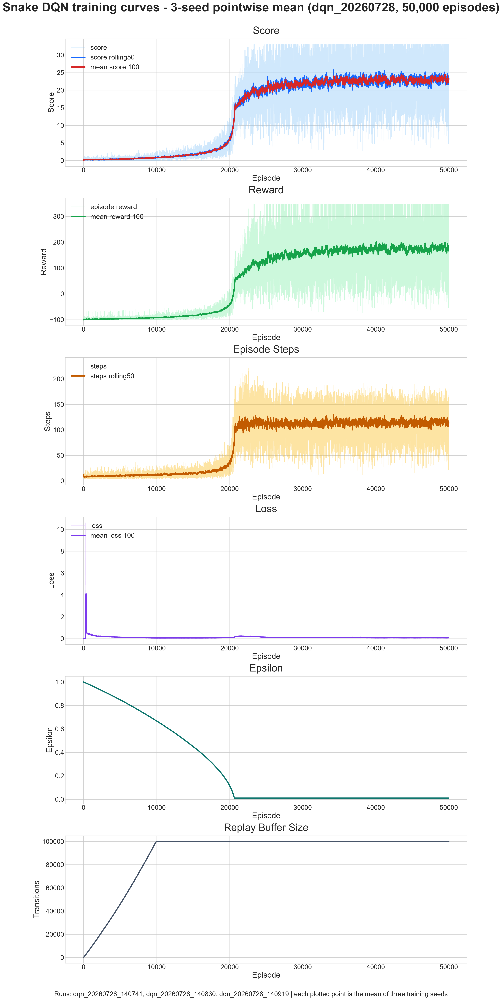
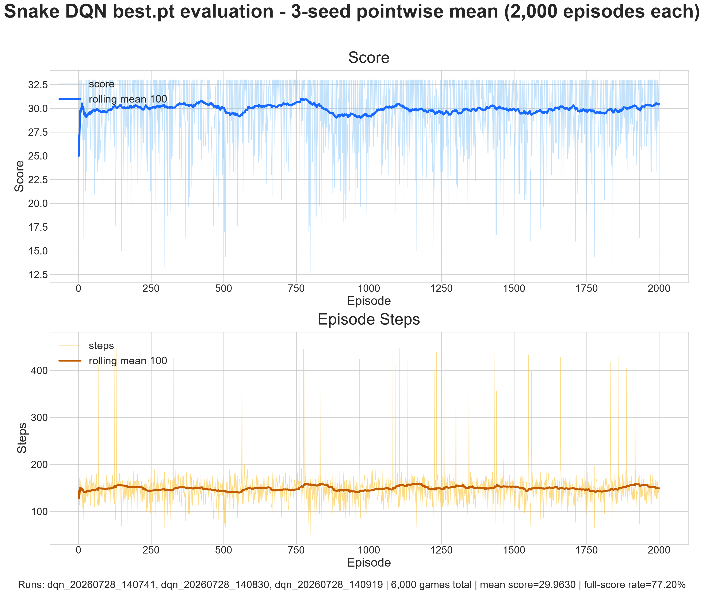
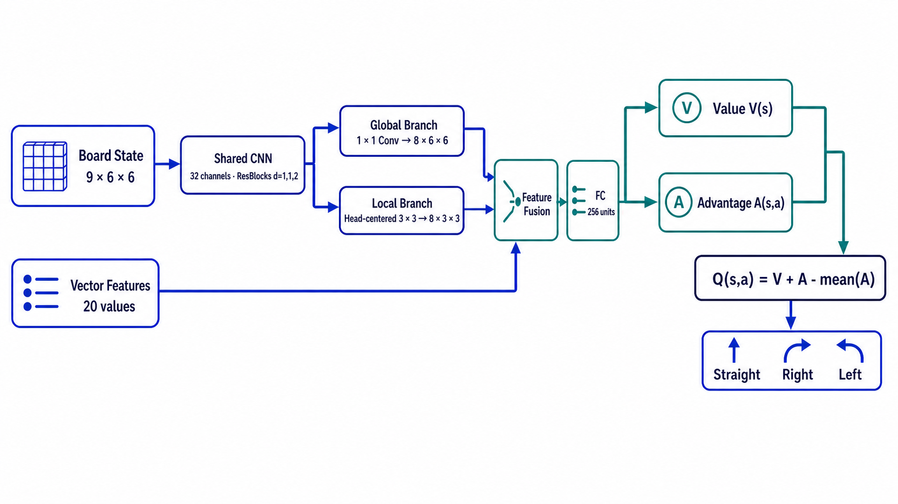

# Snake AI

一个基于 DQN 的贪吃蛇强化学习项目：可以直接运行训练好的 AI，也可以重新训练模型。项目同时提供 PPO 训练支持，但本文的实验结果和网络结构均基于 DQN。

## 演示视频

<video src="https://raw.githubusercontent.com/leijun0336-a11y/Snake/main/docs/video/Snake.mp4" controls width="720"></video>

[打开演示视频](https://raw.githubusercontent.com/leijun0336-a11y/Snake/main/docs/video/Snake.mp4)

## 快速启动游戏

需要安装 [uv](https://docs.astral.sh/uv/)，并使用 Python 3.12 或更高版本。

```bash
uv run --no-dev --extra cpu snake-play
```

这是默认推荐的启动命令。首次运行时，uv 会安装项目依赖和 CPU 版 PyTorch，但不会安装训练、实验记录或开发工具；首次下载可能需要一些时间。

游戏启动后，只有在首次进入需要 AI 模型的模式时，才会检查模型文件。如果本地不存在模型，程序会从公开的 [Hugging Face 仓库](https://huggingface.co/leijun0336-a11y/Snake)下载 `best.pt`，保存到：

```text
checkpoints/dqn_20260728_140741/best.pt
```

仓库默认附带该权重（因为模型权重比较小），因此即使无法连接 Hugging Face，也可以直接运行 AI 模式。只有在本地文件缺失时，程序才会尝试从 Hugging Face 下载模型。

之后会复用本地模型。单人模式不会触发模型下载；菜单中的 AI 观战和人机比赛模式会使用该模型。

如果当前激活的虚拟环境已经包含兼容的 CPU 或 CUDA 版 PyTorch，可以复用该环境，避免安装另一份：

```bash
uv run --active --no-dev snake-play
```

这里的 `--active` 表示优先使用当前已经激活的虚拟环境；普通用户可以直接使用上面的默认命令。

## 启动训练与评估

### 推荐：脚本启动训练

训练脚本会尝试复用系统中已经安装、且确实能够访问 GPU 的 CUDA 版 PyTorch；找不到时才安装 CUDA 12.4 版。脚本还会设置 `CUBLAS_WORKSPACE_CONFIG` 并在训练前检查 GPU 是否可用。`CUBLAS_WORKSPACE_CONFIG` 是 CUDA 线性代数库使用的确定性配置，需要和 `--deterministic` 配合；如果希望启用 PyTorch 的严格确定性算法，请追加该参数。即使如此，不同硬件、驱动、CUDA 和 PyTorch 版本之间仍可能存在细微差异。

```bash
# Linux / AutoDL
bash scripts/train_autodl.sh

# Windows
.\scripts\train_autodl.ps1
```

训练需要可用的 CUDA GPU。脚本默认训练 50,000 局，并使用 DQN、Hybrid 状态和默认奖励配置。Hybrid 状态由完整棋盘表示和 20 维人工特征共同组成，具体见“状态与动作”一节。

### 终端启动训练（替代方式）

如果希望由 uv 安装 CUDA 12.4 版 PyTorch，可以使用：

```bash
uv run --no-dev --extra cu124 --extra train snake-train
```

如果当前项目环境已经包含兼容的 GPU 版 PyTorch，则 `--extra cu124` 可以省略：

```bash
uv run --no-dev --extra train snake-train
```

如果要训练 PPO，可在上述命令后追加 `--algorithm ppo`；本文不展开 PPO 的专用配置和实验结果。

### 评估

评估脚本默认加载最近一次训练运行目录中的最佳模型文件 `best.pt`，评估 2000 局，每局最多执行 1000 步，并关闭饥饿终止。脚本会复用系统中已有的 CPU 或 CUDA 版 PyTorch；找不到时默认安装 CPU 版。

```bash
# Linux
bash scripts/evaluate.sh

# Windows
.\scripts\evaluate.ps1
```

也可以直接使用命令行：

```bash
# CPU 评估
uv run --no-dev --extra cpu snake-evaluate

# CUDA 12.4 评估
uv run --no-dev --extra cu124 snake-evaluate
```

如果当前环境已经包含兼容的 PyTorch，评估命令中的 `--extra cpu` 或 `--extra cu124` 可以省略。

训练命令中的 `--extra train` 会安装 TensorBoard 和 Weights & Biases（W&B）等实验记录工具；训练入口会在 TensorBoard 可用时自动写入训练日志，使用 W&B 时再追加 `--wandb`。评估只有在需要写入评估 CSV 和 TensorBoard 日志时才需要追加 `--tensorboard`。使用脚本评估时，脚本会根据该参数自动安装训练记录依赖；直接使用 uv 时请同时指定 `--extra train`：

```bash
uv run --no-dev --extra cu124 --extra train snake-train --help
uv run --no-dev --extra cpu snake-evaluate --help

# 直接写入评估 CSV 和 TensorBoard 日志
uv run --no-dev --extra cpu --extra train snake-evaluate --tensorboard
```

脚本和终端方式均可直接追加参数，例如：

```bash
bash scripts/train_autodl.sh --max-episodes 50000 --seed 42 --deterministic
uv run --no-dev --extra cu124 --extra train snake-train --max-episodes 50000 --seed 42
```

## 截至 2026-07-28 的三次 DQN 实验结果

以下结果对应三个训练运行：`dqn_20260728_140741`、`dqn_20260728_140830` 和 `dqn_20260728_140919`。三个运行分别使用随机种子 42、3407 和 2027。

实验使用一张 RTX 3080 Ti，三个训练进程分别在三个终端中同时运行。从首个进程启动到最后一个进程结束的实际经过时间为 29 小时 39 分 16 秒。

### 训练曲线

三个实验均训练 50,000 局。图中的每个点先按三个运行中相同局数编号的指标取算术平均，再对该平均序列计算滚动均值。

- **Score**：单局吃到的食物数量；`score rolling50` 和 `mean score 100` 分别是最近 50 局和 100 局的平均分。
- **Reward**：单局所有环境奖励之和；`mean reward 100` 是最近 100 局的平均值。单局奖励按奖励分量累加：
  `episode_reward = food_reward + progress_reward + step_penalty + hunger_penalty + terminal_reward`。
  因此 Reward 不只由 Score 决定。
- **Episode Steps**：单局执行的环境步数；`steps rolling50` 是最近 50 局的平均步数。
- **Loss**：该局内所有 DQN 梯度更新的平均 Huber loss；`mean loss 100` 是最近 100 局每局 loss 的平均值。尚未产生梯度更新的局会记录为 0。Loss 与 Score 或 Reward 之间不存在固定换算关系。
- **Epsilon**：epsilon-greedy 的随机探索概率。对每个运行，默认按累计环境步数线性衰减：
  `epsilon = max(0.01, 1.0 - 0.99 × environment_steps / 300000)`，其中 `environment_steps` 是从训练开始累计执行的环境步数。
  因此 epsilon 与局数之间没有固定线性关系；图中显示的是三个运行的逐局平均值。
- **Replay Buffer Size**：经验池中保存的转移样本（transition）数量。默认使用 `n_step=1`，即每次用一步转移样本计算训练目标；经验池容量为 100000，因此对每个运行有
  `buffer_size = min(environment_steps, 100000)`；图中同样显示三个运行的逐局平均值。



### `best.pt` 评估曲线

每个运行的 `best.pt` 均独立评估 2,000 局。评估使用固定的随机种子生成食物出现顺序，每局最多执行 1,000 步，并关闭饥饿终止。图中每个评估局序号按三个模型的对应结果取算术平均，再计算最近 100 局的滚动均值；这里的“对应”指相同的局数编号，不代表三个模型一定面对完全相同的随机局面。

| 随机种子 | 运行目录 | Score 平均值 | 最大蛇长平均值 | 满分率 | 超时率 |
|---:|---|---:|---:|---:|---:|
| 42 | `dqn_20260728_140741` | 30.2840 | 33.2840 | 77.70% | 0.45% |
| 3407 | `dqn_20260728_140830` | 29.7275 | 32.7275 | 76.15% | 0.40% |
| 2027 | `dqn_20260728_140919` | 29.8775 | 32.8775 | 77.75% | 0.55% |
| 三个随机种子平均 | — | 29.9630 | 32.9630 | 77.20% | 0.47% |

表格及评估图中的指标含义如下：

- **Score 平均值**：2000 个评估局得分的算术平均值。
- **最大蛇长平均值**：每局达到的最大蛇长再取平均。本环境中蛇只增长、不缩短，初始蛇长为 3，因此每局恒有 `最大蛇长 = Score + 3`，进而恒有 `最大蛇长平均值 = Score 平均值 + 3`。
- **满分率**：得分达到 `6 × 6 - 3 = 33` 的局数除以 2000；等价条件是最大蛇长达到 36。它由得分分布决定，不能只通过 Score 平均值计算。
- **超时率**：评估循环达到 1000 步上限时仍未终止的局数除以 2000。超时局的 Steps 为 1000，但超时率不能从平均步数直接反推。
- **Score 图**：浅色线是三个模型在相同评估局序号上的得分平均值，深色线是该序列最近 100 局的滚动均值。
- **Episode Steps 图**：浅色线是三个模型在相同评估局序号上的步数平均值，深色线是该序列最近 100 局的滚动均值。
- 表格最后一行是三个随机种子的算术平均。由于每个随机种子都评估 2000 局，它也等于将全部 6000 局合并后计算的总体结果。图中的末端滚动均值只覆盖最后 100 个评估局，不等于表格中的 2000 局总体平均值。



## 贪吃蛇 AI 的实现方法

以下“训练规则”和“评估规则”指默认的 6 × 6 环境。交互式游戏中的单人模式、AI 观战模式和人机比赛模式关闭饥饿终止，并使用 400 步运行上限；这与训练环境的饥饿终止和最终评估的 1000 步上限不同。

### 游戏规则

- 棋盘大小为 `6 × 6`，蛇的初始长度为 3，默认食物均匀随机出现在空格中。
- AI 每一步只能选择**直行、右转、左转**，不能直接反向。
- 吃到食物后得 1 分，蛇身增长一格；占满 36 个格子即完成棋盘，因此满分为 `36 - 3 = 33`。
- 撞墙、撞到自身都会结束游戏。
- 默认训练使用本文所述的奖励配置：如果连续超过 36 步没有吃到食物，也会因饥饿终止，以减少无意义的循环。最终评估和交互式游戏关闭该机制。

### 状态与动作

本文实验使用 Hybrid 状态，同时观察：

- **棋盘状态**：9 个通道，分别表示边界、蛇身、四种蛇头方向、蛇尾、食物和身体顺序；
- **人工特征**：20 个数值，描述三个动作是否危险、当前方向、食物方位、到墙和蛇身的距离，以及饥饿程度。

CNN 提取完整棋盘的全局特征，并以蛇头为中心提取 `3 × 3` 的局部特征，再与人工特征拼接。网络最终为三个动作分别输出一个 Q 值，选择预期折扣累计收益最高的动作。

### 奖励设计

以下数值是本文默认训练配置下的奖励分量，不代表单步总奖励。更换奖励配置或关闭成本奖励后，数值和终止条件可能不同。

| 事件 | 奖励分量 |
|---|---:|
| 吃到食物 | `+10` |
| 占满棋盘 | 额外终止奖励 `+20` |
| 撞墙或撞到身体 | 终止惩罚 `-100` |
| 因饥饿终止 | 终止惩罚 `-12` |
| 每次合法移动 | 步成本 `-0.005`，包括吃到食物的移动 |
| 未进食时的饥饿成本 | `-0.02 × hunger_ratio²` |

其中 `hunger_ratio = min(连续未进食步数 / 36, 1)`，表示当前饥饿程度。饥饿成本只在未吃到食物的合法移动上产生；因饥饿终止时还会额外产生 `-12` 终止惩罚。

此外还使用基于食物距离的势函数进度奖励；它根据蛇头与食物距离的变化，为接近食物的动作提供额外反馈。默认情况下：

```text
r_progress = beta × (gamma × Phi(s') - Phi(s))
Phi(s) = 1 - d(s) / 10
d(s) = 蛇头与食物的曼哈顿距离
beta = 1.0
gamma = 0.995
```

终止状态的势函数取 0，下一状态的食物位置使用环境实际放置的新食物。单步总奖励是食物奖励、进度奖励、步成本、饥饿成本和终止奖励之和。

### DQN 算法

1. **探索**：训练初期通过 epsilon-greedy 随机尝试动作，之后逐步降低随机概率。
2. **经验回放**：把 `(状态、动作、奖励、下一状态)` 保存到经验池；默认启用优先经验回放（PER），优先抽取时序差分误差（TD error）较大的经验，并使用重要性采样权重修正采样偏差。
3. **Double DQN**：策略网络选择下一动作，目标网络评估该动作，减少 Q 值过高估计。
4. **Dueling DQN**：分别估计状态价值和各动作的相对优势，再组合成三个动作的 Q 值。
5. **模型选拔**：默认探索概率降至下限后开始阶段验证。先用 100 局进行快速筛选，通过后再用 500 局进行确认；之后每 1000 局训练进行一次相同流程。表现达到预设标准的模型才会更新 `best.pt`，该过程不根据训练 loss 直接选拔。最终再进行独立的 2000 局评估。

### Q 网络结构

Q 值表示在当前状态选择某个动作后，按照折扣因子 `gamma=0.995` 预计能够获得的长期累计收益。训练时使用两套结构相同的网络：

- **策略网络（Policy Network）**：持续学习，并负责选择动作；
- **目标网络（Target Network）**：每隔 1000 次 DQN 梯度更新从策略网络同步参数，用于计算更稳定的训练目标。

网络先用 CNN 提取完整棋盘的全局特征和蛇头周围 `3 × 3` 的局部特征，再与 20 维人工特征融合。Dueling Head（将状态价值和动作优势分开建模的输出层）将融合特征拆分为状态价值 `V(s)` 和动作优势 `A(s,a)`，最后计算：

```text
Q(s,a) = V(s) + A(s,a) - mean(A(s,·))
```



*图：Hybrid Dueling Q-Network 的简化结构。*
