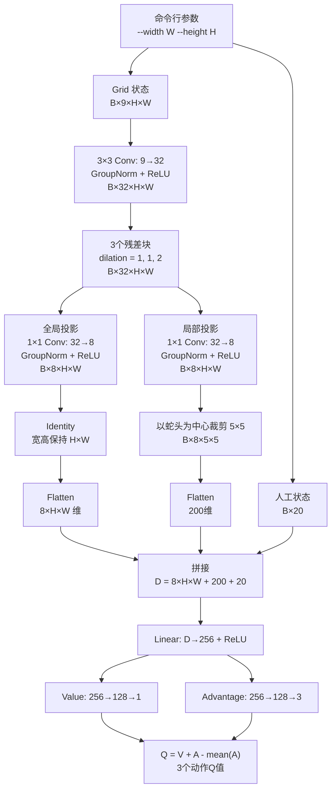

# 动态网格 Hybrid Q 网络改造方案

> 状态：已确认并实施。实现结果见 `dynamic_grid_network_implementation_report.md`。

## 目标

- 网络宽高由 `--width W --height H` 决定，不再固定池化到 10×10。
- 删除 `AdaptiveAvgPool2d`，全局分支完整保留当前网格的空间分辨率。
- 继续保留共享 CNN、全局/蛇头局部双分支和 Dueling Q 头。
- 每个网格尺寸独立构建模型并保存 checkpoint；本次不实现同一个 checkpoint 在训练中切换尺寸。

## 架构图



## 动态维度

Hybrid 融合维度统一按以下公式构造：

```text
global_size = 8 * height * width
local_size = 8 * 5 * 5 = 200
fused_size = global_size + local_size + auxiliary_size
           = 8 * height * width + 220
```

| `width × height` | 全局维度 | 局部维度 | 人工状态 | `fused_size` |
|---|---:|---:|---:|---:|
| 6×6 | 288 | 200 | 20 | 508 |
| 10×10 | 800 | 200 | 20 | 1020 |
| 20×20 | 3200 | 200 | 20 | 3420 |
| W×H | `8WH` | 200 | 20 | `8WH + 220` |

## 计划修改

1. `q_network.py`
   - 删除 `_build_pool_layer()` 和 `AdaptiveAvgPool2d` 回退逻辑。
   - 全局分支改用 `nn.Identity()`。
   - 使用实际 `height`、`width` 计算 `global_size` 和 `fused_size`。
   - 更新写死 20×20、10×10 和 1020 维的注释。

2. `config.py`、`train.py`、`dqn_agent.py`
   - 删除 `cnn_pool_size` 配置和 `--cnn-pool-size` 参数。
   - checkpoint 不再保存池化目标尺寸，架构版本升级。
   - 加载时继续校验 checkpoint 的 Grid 高宽与当前环境一致。

3. checkpoint 版本策略
   - 当前运行时代码只接受架构版本3和完整架构字段。
   - 非当前版本直接报错，不猜测缺失字段，也不回退到历史网络。
   - 历史 checkpoint 使用与其匹配的 Git 版本评估。

4. 确定性模式
   - `--deterministic` 改为严格模式，不再使用 `warn_only=True`。
   - 若仍有不确定 CUDA 算子，应立即报错，避免产生“已确定但仍不可复现”的假象。

## 验收测试

- 对 6×6、10×10、20×20 和一个矩形网格分别构建 Grid/Hybrid 网络。
- 验证网络输出均为 `[batch_size, 3]`。
- 验证融合维度分别为508、1020、3420以及公式计算值。
- 验证网络中不存在 `AdaptiveAvgPool2d`。
- 验证当前版本 checkpoint 的参数化重建，以及非当前版本的清晰报错。
- 在相同机器和软件环境中运行两次同种子短训练，比较逐步指标和最终权重。

## 边界与代价

- 这是“不同尺寸分别训练不同模型”，不是“一个模型在同一训练过程中混合多种尺寸”。
- `Linear` 参数量随 `H×W` 增长；20×20会比10×10增加约61万项 `D→256` 权重。
- 不同网格尺寸的 checkpoint 默认不能互换，因为其全连接输入形状不同。
- 如果未来需要同一模型混合尺寸，应另行设计“补齐到统一最大棋盘并增加有效区域 mask”，而不是重新引入自适应池化。

## 确认后的执行顺序

1. 修改网络和配置传递。
2. 实现严格 checkpoint 版本校验与错误提示。
3. 更新测试、README和网络结构说明。
4. 运行完整测试，再进行短程确定性复现验证。
