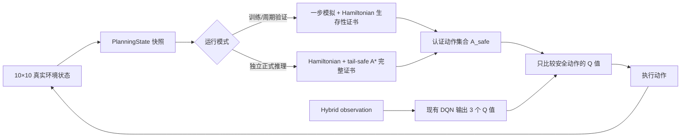

# 10×10 安全规划器：Hamiltonian、tail-safe A* 与 Masked DQN 如何配合

## 1. 先说结论

这个分支没有修改原来的 6×6 AI。默认训练命令也完全不使用规划器。只有显式传入
`--mask` 时，10×10 训练才会在每一步启用“安全动作认证器”。训练和正式推理都遵守
Hamiltonian 顺序不变量，但为了训练速度，使用两种强度不同的认证：

1. `--mask` 训练和周期验证使用轻量 Hamiltonian 生存性证书，不运行 A*；
2. 独立的 10×10 正式推理入口使用 Hamiltonian + tail-safe A* 的完整证书；
3. 两种证书得到安全动作集合后，DQN 才能在集合内探索或选择 Q 值最大的动作；
4. 完整推理中的 A* 路径还必须通过真实蛇身模拟、饥饿边界和吃完后的蛇尾可达检查。

用数学式写就是

\[
a^*=\mathop{\arg\max}_{a\in A_{\text{safe}}(s)}Q_\theta(o,a).
\]

其中，`s` 是不丢失蛇身细节的真实环境快照，`o` 是送进 DQN 的 Hybrid observation，
`A_safe(s)` 是规划器认证通过的动作集合。未认证动作无论 Q 值多大都不能执行；规划器
无法认证任何动作时直接报错，不能绕过安全集合。

例如 DQN 输出

\[
(Q_{\text{直行}},Q_{\text{右转}},Q_{\text{左转}})=(4.7,8.1,2.9),
\]

但规划器只认证了直行和左转，那么最终选择直行。虽然右转的 8.1 最大，但它不在安全
集合里。



## 2. 项目里的状态和动作

规划器不从神经网络 observation 反推蛇的位置，而是直接读取环境并构造不可变的
`PlanningState`：

- `snake[0]` 是蛇头，最后一个元素是蛇尾；
- `direction` 是当前绝对方向；
- `food` 是当前食物；
- `steps_since_food` 是连续未进食步数；
- 棋盘必须严格等于 10×10。

环境的三个动作是相对动作：

| 动作编号 | 含义 |
|---:|---|
| 0 | 保持当前方向直行 |
| 1 | 相对当前方向右转 |
| 2 | 相对当前方向左转 |

因此 A* 的节点不能只记录坐标。即使蛇头在同一个格子，面朝上和面朝右时下一步可选的
三个方向也不同，所以快速 A* 使用 `(蛇头坐标, 当前方向)` 作为搜索节点。

`PlanningState` 创建时还会检查：蛇身格不重复、全部在棋盘内、相邻身体格的曼哈顿距离
等于 1、食物不与蛇重叠、蛇头方向与“颈部到蛇头”的几何方向一致。异常状态不会进入
规划器。

## 3. 为什么先做一个无副作用模拟器

A* 找到的坐标路径不能直接当成环境路径。贪吃蛇有两个很容易写错的转移细节：

- 普通移动时蛇尾会离开原格，所以蛇头可以进入“当前蛇尾格”；碰撞集合是
  `snake[1:-1]`；
- 吃食物时蛇尾不移动，所以这一步的碰撞集合是 `snake[1:]`，随后蛇长加一。

`simulate_action()` 按照 `SnakeEnv.step()` 的这些规则复制一步，但不会修改真实环境。
它同时更新方向、蛇身、是否吃到食物、是否填满棋盘和连续未进食步数。规划器对整条
候选路径逐步模拟，而不是只检查路径上的格子有没有撞到当前蛇身。

这层模拟器是安全认证的基础。如果模拟器和环境语义不一致，后面的数学条件再漂亮也
没有意义。因此测试中不仅验证几个手写局面，还在多批真实可达状态上对三个动作逐一做
`simulate_action()` 与 `SnakeEnv.step()` 的差分比较。

## 4. Hamiltonian 环是什么

### 4.1 定义

图论中的 Hamiltonian 环是一条闭合路径，它恰好访问图中的每个顶点一次。在这里：

- 每个棋盘格是一个顶点；
- 上、下、左、右相邻的格子之间有边；
- 10×10 棋盘有 100 个顶点。

固定环给每个格子一个编号

\[
H(p)\in\{0,1,\ldots,99\},
\]

并保证编号相邻的格子在棋盘上也相邻；编号 99 与编号 0 同样相邻。

### 4.2 本项目如何构造环

实现没有在每一帧重新求 Hamiltonian 环，而是为固定的 10×10 棋盘生成一条确定的环：

1. 先沿第 0 列从上向下；
2. 在第 1～9 列中，从第 9 行到第 1 行来回蛇形；
3. 最后沿第 0 行从右向左返回起点。

这个方向经过专门对齐，使环境 reset 后的蛇尾、身体、蛇头
`(3,5) → (4,5) → (5,5)` 正好沿环编号递增，蛇头的环后继是 `(6,5)`。

### 4.3 “身体沿环有序”怎样计算

设蛇长为 `m`。先把项目中“蛇头到蛇尾”的数组反转，得到蛇尾到蛇头的环编号

\[
i_0,i_1,\ldots,i_{m-1}.
\]

相邻身体点沿环正方向的距离为

\[
d_k=(i_{k+1}-i_k)\bmod 100.
\]

规划器要求

\[
\sum_{k=0}^{m-2}d_k < 100.
\]

这个条件的直观意思是：从蛇尾沿环正方向走到蛇头时，还没有绕满一整圈，所以蛇头没有
越过蛇尾。`d_k` 不要求等于 1，因此允许 A* 走安全捷径后在环编号之间留下空格；但蛇身
的首尾顺序不能被打乱。

状态兼容性还会检查环后继是否能由项目的直行、右转、左转动作实现，排除必须直接反向
的人工异常状态。

### 4.4 Hamiltonian 守卫怎样认证一步

对动作 0、1、2 分别执行一次精确模拟，然后只保留满足以下条件的动作：

1. 不撞墙、不撞身体；
2. 新蛇身仍满足上面的环顺序；
3. 环后继仍能由合法相对动作到达。

这些动作叫 `cycle_safe_actions`。A* 只能从它们中继续认证，不能为了更短路径破坏长期
顺序。

只要从一个有序状态开始并且每一步都保持这个不变量，沿固定环后继移动就是长期安全
基线：蛇头位于“蛇头到蛇尾”的空闲环段上，不会从环编号上越过自己的身体。

## 5. A* 在这里具体搜索什么

### 5.1 评价函数

A* 为每个搜索节点计算

\[
f(n)=g(n)+h(n),
\]

其中：

- `g(n)` 是从起点到节点已经走过的步数；
- `h(n)` 是当前蛇头到食物的曼哈顿距离：

\[
h=|x-x_f|+|y-y_f|.
\]

曼哈顿距离忽略障碍物，所以不会高估四邻接棋盘上的最短剩余距离。它是一个可采纳启发
函数；优先队列先扩展 `f` 较小的节点。

规划器会分别固定每个 Hamiltonian-safe 首动作，再搜索从该动作后状态到食物的路径。
这样可以得到“若第一步选动作 0/1/2，各自有没有完整安全吃食物路径”的答案。

### 5.2 快速静态 A*

普通帧首先运行快速 A*：

- 节点是 `(蛇头坐标, 方向)`；
- 当前身体除蛇尾外暂时视为障碍；
- 当前蛇尾允许进入，因为普通移动时它会释放；
- 搜索结果只是一条候选路径，不是安全证明。

候选路径随后从原状态完整模拟。任何一步碰撞、破坏 Hamiltonian 顺序、没有在末步吃到
食物，整条候选都会被拒绝。

### 5.3 为什么还需要完整状态 A*

静态 A* 只返回一条几何最短路。可能存在两条同样长的路径：第一条会破坏 Hamiltonian
顺序，第二条完全安全。如果只在搜索结束后拒绝第一条，就会产生“第一条候选失败，所以
没有安全路径”的假阴性。

因此，对某个首动作，如果快速候选失败，规划器会只为这个候选启用完整状态 A*：

- 搜索 key 是 `(完整蛇身, 当前方向, 当前食物)`；
- 每条边都调用 `simulate_action()`；
- 搜索扩展阶段立刻剪掉碰撞或破坏 Hamiltonian 不变量的状态；
- 默认最多扩展 500 个完整状态。

完整状态搜索明显更贵，所以静态候选已经通过时不会运行它。超过 500 次扩展不是把动作
判成安全，而是表示“本次有界搜索没有给出证明”。若全部候选都无证明，随后只能检查
Hamiltonian 安全基线路径。

## 6. tail-safe 到底检查什么

“能吃到食物”不等于“吃完还能活”。蛇吃到食物后尾巴不会移动，可能把自己封在一个小
区域中。因此每条食物路径吃完后还要检查：

1. 若蛇已占满 100 格，游戏已经胜利，直接通过；
2. 否则把蛇身中除蛇尾外的格子视为障碍；
3. 从新蛇头做四邻接 BFS，计算静态可达集合；
4. 新蛇尾必须在这个集合中。

这里 BFS 只回答“拓扑上是否连通”，不生成最终控制动作。真实可执行性还受到整个路径上
Hamiltonian 顺序不变量的保护。也就是说，本实现里的 tail-safe 不是单独一个万能证明，
而是“吃食物后蛇尾可达”与“Hamiltonian 长期顺序”两个条件的组合。

最终认证路径必须同时满足：

- 每一步真实模拟合法；
- 每一步保持 Hamiltonian 顺序；
- 最后一步确实吃到当前食物；
- 吃完后蛇尾可达，或棋盘已经填满；
- 在饿死之前到达食物。

## 7. 饥饿边界为什么是 `101 - s`

`experiment8` 在连续未进食步数严格大于 100 时饿死。设当前已经有 `s` 步未进食，一条
路径共有 `L` 个动作，并且最后一个动作吃到食物。前 `L-1` 步都不进食，因此必须满足

\[
s+(L-1)\le 100.
\]

移项得到

\[
L\le 101-s.
\]

这就是代码里的 `max_actions_to_food = 100 - steps_since_food + 1`。当 `s=100` 时，只允许
下一步立刻吃到食物；若再普通移动一步，真实环境会在 101 处终止。

严格分支不允许把 `starvation_limit` 改成 200 等其他值，因为那会让规划器认证真实环境
中必然饿死的动作。即使使用关闭 starvation 的历史评估协议，规划器也仍保留 100 步
安全边界，不放宽认证。

## 8. A* 找不到时，Hamiltonian 做什么

若各首动作的快速 A*、完整状态 A* 和已认证路径后缀都没有提供路径，规划器沿固定环后继生成一条
到当前食物的确定路径。该路径仍要经过：

- 完整动态模拟；
- 每一步 Hamiltonian 不变量检查；
- 饥饿预算检查；
- 最终 tail-safe 检查。

只有全部通过，才返回第一个动作，决策层级记为 `hamiltonian_cycle`。

这不是“搜索失败后随便走一步”的 fallback，更不是退回原始 DQN。它是一条独立完成
安全证明的基线路径。如果连这条路径也不能证明，规划器抛出 `NoSafeActionError` 并停止，
不会选择 legal action、最大空间动作或原始 Q 最大动作来掩盖错误。

## 9. 为什么需要“已认证路径承诺”

每帧重新规划有一个隐蔽问题：上一帧已经证明路径

\[
(a_0,a_1,\ldots,a_{L-1})
\]

完整安全，执行 `a_0` 后，如果下一帧把证明全部丢掉，受搜索上限或静态 A* 选路顺序
影响，仍可能错误地报告“找不到路径”。

因此 `PlannerDecision` 不只返回首动作，还为每个可选动作保存一条 `certified_path`。
DQN 选中 `a_0` 后，策略保存后缀

\[
(a_1,\ldots,a_{L-1})
\]

以及精确模拟得到的下一状态。下一帧会先检查真实状态是否与预期相同，再重新验证这段
后缀并把它加入安全候选。推理时还会认证其他首动作；DQN 可以改选另一条认证路径，被
选中的新路径又会成为新的承诺。已提交首动作不重复运行 A*，因为它的后缀已在本帧重新
做过完整模拟验证。

若真实状态与承诺不一致，抛出 `PlanCommitmentError`。新一局开始前 evaluator 必须调用
`policy.reset()` 清除上一局承诺。这种设计保证不会用“悄悄丢弃证明并继续走”来处理状态
分歧。

## 10. 推理时 DQN 怎样使用安全集合

不带 `--mask` 的普通训练没有改动以下部分：

- DQN 网络结构和参数；
- 10×10 checkpoint；
- 原来的 `DQNAgent.act/remember/learn`；
- 原来的 `Transition` 与 `ReplayBuffer`；
- 原来的 Double/Dueling DQN 目标、损失函数和 target network；
- 原来的 6×6 AI profile、控制器和游戏模式。

新增策略直接调用现有 `policy_net` 得到三个 Q 值，并使用 `torch.inference_mode()`。它不调用
带探索逻辑的训练动作接口，也不修改 epsilon。Q 值若包含 `NaN` 或无穷大，会明确报错。

阶段二不再只暴露最短路线。对每个 Hamiltonian-safe 首动作，规划器分别寻找并完整验证
一条到食物的 tail-safe 路径；所有有安全证明的首动作都交给 DQN。这样 DQN 才可能学习
“当前多走一步，但让后续局面更高效”的长期差异。Q 值相同时按较小动作编号稳定选择。

## 11. `--mask` 训练具体改变什么

### 11.1 开关和隔离边界

普通训练命令不带 `--mask`：

```bash
python -m snake_ai.train --width 6 --height 6
```

此时不会导入或创建 Hamiltonian/A* 规划器，不计算掩码，不增加规划器相关随机调用，仍
实例化普通 `DQNAgent` 和普通 `ReplayBuffer`。6×6 的验证上限仍默认 1000 步，checkpoint
中也没有 `mask_*` 字段。

Masked DQN 必须显式写出参数：

```bash
python -m snake_ai.train --mask --width 10 --height 10
```

`--mask` 严格要求 10×10、Hybrid observation 和 `experiment8`。不满足时直接报错，不会
静默退回普通 DQN。Masked 验证默认最多 5000 步，覆盖纯 Hamiltonian 的 4753 步理论上界。

### 11.2 当前动作怎样加掩码

训练认证器先对动作 `a∈{0,1,2}` 精确模拟一步。碰墙、碰身体或破坏 Hamiltonian 环顺序的
动作直接拒绝。若这一步没有吃到食物，设新蛇头的环编号为 `H(h')`，食物环编号为
`H(f)`，环长 `N=100`，那么沿环前进到食物还需要

\[
d_H(h',f)=(H(f)-H(h'))\bmod N
\]

步。从当前帧算起，这条明确可执行的恢复路线一共需要 `1+d_H` 步。`experiment8` 在
`steps_since_food > 100` 时才饿死，所以剩余可执行步数为

\[
B=100-steps\_since\_food+1.
\]

只有 `1+d_H≤B` 才认证该动作；若候选第一步就吃到食物，则直接通过。这个证明不是说 DQN
后面必须机械地沿环走，而是证明“即使现在走捷径，仍然保留了一条来得及吃到食物的环上
退路”。下一帧会用新的真实状态和更小的饥饿预算重新认证，因此 DQN 不能无限拖延。

认证器最后返回三个布尔值组成的掩码

\[
M(s)=(M_0,M_1,M_2),\qquad M_a\in\{0,1\}.
\]

探索时不再从三个动作均匀抽取，而只从集合

\[
A_{\mathrm{safe}}(s)=\{a\mid M_a(s)=1\}
\]

中随机抽取。利用时先把不安全动作的 Q 值改成负无穷，再取最大值：

\[
a=\arg\max_a\left(Q_\theta(s,a)+I[M_a(s)=0](-\infty)\right).
\]

因此 epsilon 探索也不能越过安全边界，这一点不同于“只在贪心动作上加掩码”。
训练和周期验证的这一步只有最多三次单步模拟、环顺序检查和整数减法，没有 A*、BFS、
优先队列或搜索 expansion 上限。

### 11.3 replay 和 Double DQN 目标怎样加掩码

普通经验仍是五元组。Masked 经验单独保存

\[
(s,a,r,s',done,M(s),M(s')).
\]

写入 replay 时会再次检查实际动作满足 `M_a(s)=1`。从 replay 采样后，Double DQN 的在线
网络只在下一状态安全动作中选择动作：

\[
a'=\arg\max_{a:M_a(s')=1}Q_\theta(s',a).
\]

目标网络只评估这个动作：

\[
y=r+\gamma(1-done)Q_{\bar\theta}(s',a').
\]

终止状态没有下一次决策，但 batch 张量仍需要合法形状，因此保存全真占位掩码；公式中的
`1-done=0` 会消除其 bootstrap 值。

### 11.4 checkpoint 和 best.pt

Masked checkpoint 额外保存 `mask_enabled=true`、`mask_version=2` 和规划器名称
`hamiltonian_viability`。Masked agent 拒绝把普通 checkpoint 或旧版在线 A* masked
checkpoint 当成当前 checkpoint 恢复；普通 DQN checkpoint 的结构保持不变。

普通 6×6 的 best.pt 选择规则也保持不变。只有 masked 训练会在平均分和满盘率都不下降
时，用更低的固定种子平均 steps 作为额外晋升条件，避免已经满盘后永远保存第一次的慢
模型，也防止通过更早死亡伪造“步数更少”。

## 12. 代码文件对应关系

| 文件 | 作用 |
|---|---|
| `planning_10x10/types.py` | 不可变状态、认证结果、严格异常类型 |
| `planning_10x10/simulator.py` | 与真实环境一致的无副作用单步/路径模拟 |
| `planning_10x10/hamiltonian.py` | 固定环、环编号顺序、环后继路径和训练用轻量生存性认证 |
| `planning_10x10/astar.py` | 快速静态 A* 与按完整蛇身扩展的 A* |
| `planning_10x10/tail_safe.py` | 食物路径模拟、尾巴可达与动态重搜索 |
| `planning_10x10/planner.py` | 组合所有条件并产生安全动作集合 |
| `planning_10x10/dqn_policy.py` | 在安全集合中取最大 Q，维护路径承诺 |
| `planning_10x10/metrics.py` | 覆盖率、决策层级和耗时统计 |
| `evaluate_planned_10x10.py` | 10×10 独立推理评估入口 |
| `agents/replay_buffer.py` | 普通 replay，以及完全隔离的 masked transition/replay |
| `agents/dqn_agent.py` | 原 DQNAgent，以及 masked 探索、利用和 TD 目标 |
| `train.py` | 默认关闭的 `--mask` 分支、逐步认证和 checkpoint 配置 |
| `validation.py` | 可注入 masked 动作选择器；masked 模式额外比较 steps |
| `tests/planning_10x10/` | 单元、差分、对抗回归与集成测试 |

这些文件与原 6×6 流程并列。`ai_profiles.py`、现有 `DQNController` 和原 `evaluate.py` 没有
被改成规划器版本。

## 13. 如何运行

必须显式给出 checkpoint，程序不会自动寻找 latest、best 或其他模型：

```powershell
.\scripts\evaluate_planned_10x10.ps1 `
  --checkpoint checkpoints\dqn_20260718_113440\best.pt `
  --episodes 10 `
  --protocol training-semantics `
  --output-dir runs\planned_10x10_example
```

Linux/macOS：

```bash
bash scripts/evaluate_planned_10x10.sh \
  --checkpoint checkpoints/dqn_20260718_113440/best.pt \
  --episodes 10 \
  --protocol training-semantics \
  --output-dir runs/planned_10x10_example
```

也可以直接运行模块：

```bash
python -m snake_ai.evaluate_planned_10x10 \
  --checkpoint checkpoints/dqn_20260718_113440/best.pt \
  --episodes 10
```

checkpoint 会严格校验：架构版本 3、Hybrid 状态、`(9,10,10)` 网格输入、三个动作、10×10
环境、`experiment8`、训练时启用 starvation，以及 `board_area` 与 `gt` 的饥饿语义。任何不
匹配都会报错，不会换用其他权重。

`--output-dir` 必须是不存在的新目录，避免覆盖或混入历史结果。输出包括汇总 JSON 信息
和逐局 CSV；其中会记录单/多安全动作比例、平均可选动作数、原始 DQN 动作通过率、DQN
在多动作状态中的选择参与度、Hamiltonian 基线路径比例和规划耗时。

AutoDL 上启动 masked 训练可以使用原包装脚本，它会继续转发所有参数：

```bash
bash scripts/train_autodl.sh \
  --mask \
  --width 10 \
  --height 10 \
  --validation-max-steps 5000
```

不写 `--mask` 时，包装脚本仍运行原训练流程。

## 14. 计算量与训练速度

不带 `--mask` 时不会运行规划器，因此不降低现有 6×6 训练速度。带 `--mask` 时，每个训练
step 都必须认证当前掩码，环境执行后还要认证下一状态掩码；下一状态掩码会直接复用为下
一轮当前掩码，所以不会在相邻两步之间重复计算同一个状态。

设蛇长为 `n`。训练用认证最多枚举 3 个动作；每个动作的蛇身模拟和顺序检查是 `O(n)`，
环距离计算是 `O(1)`，所以每帧总复杂度是 `O(3n)=O(n)`，额外空间也是 `O(n)`。10×10
中 `n≤100`，这是很小的固定上界。

本地速度冒烟中，轻量证书为约 `31.5 μs/帧`，即约 `3.18 万次/秒`；只与严格规划器在
简单初始局面比较也快约 `72.5` 倍。随机 masked 策略的一局走了 3594 步并满盘，包含
Python/PyTorch 启动、日志和 checkpoint 写盘的进程总时间为 8.57 秒。数字会随机器变化，
但它说明训练瓶颈已经不在 Hamiltonian 认证；实际长训练主要耗时会回到神经网络前向、
反向传播、磁盘日志和阶段验证。

完整 tail-safe A* 的复杂度分析仍适用于独立正式推理，但不再适用于训练：快速 A* 有至多
约 `4×10×10=400` 个几何状态，完整状态 A* 还要保存蛇身并受 expansion 上限控制。它仍
更严格、能认证更多非环上捷径，但不会占用每个训练 step 的 CPU 时间。

开发验证还包括真实 checkpoint 满盘推理、10 步 masked 训练和两次同种子 6×6 普通训练
张量逐项对比。最终项目全量测试为 211 个，
其中 10×10 专项测试覆盖：环境差分、尾格释放、进食增长、环闭合与顺序、饥饿边界、
A* 假阴性反例、路径承诺、无安全动作时禁止回退、masked TD 目标、checkpoint 隔离和真实
训练/推理循环。

## 15. 安全保证的边界

这里的“安全”不是说 DQN 一定走全局最短路，也不是脱离工程前提的形式化证明。保证依赖
以下条件：

1. 初始状态满足配置的 Hamiltonian 顺序；
2. `simulate_action()` 与 `SnakeEnv.step()` 的转移语义一致；
3. 真实环境在两次决策之间只执行策略返回的一个动作；
4. 棋盘、奖励 profile 和饥饿边界与严格校验的元数据一致；
5. 每次吃到新食物后都从真实环境重新读取状态；
6. 新一局调用 `policy.reset()`。

在这些前提下，DQN 不能执行未认证动作；搜索预算不足时也不会退回原始 DQN。规划器可能
因为有界搜索过于保守而明确停止，但不会为了继续运行而把“未证明安全”当成“安全”。
这里的“搜索预算”只针对独立正式推理的 A*；训练认证器没有搜索预算，若轻量 Hamiltonian
证书得不到任何动作，也会直接报错而不是回退。
